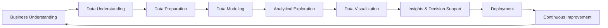
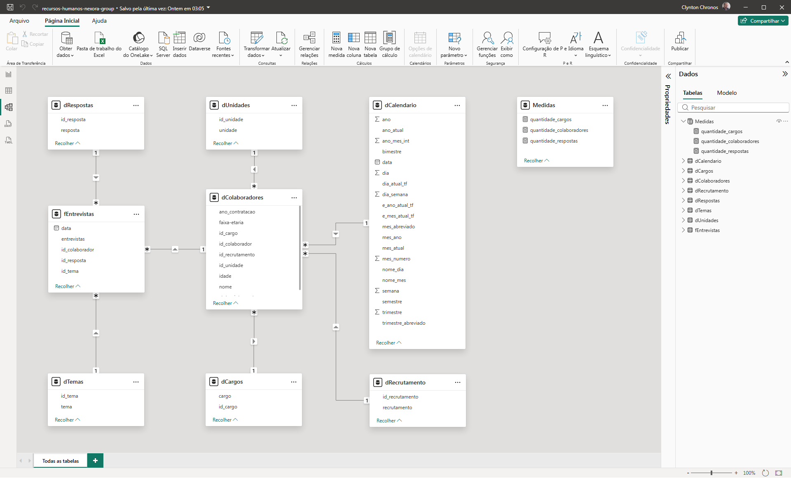

# Projeto Recursos Humanos — Nexora Group
  

---

Índice:
 

- 📊 [Visão Geral](#-visão-geral)
- 🧠 [Contexto do Problema](#-contexto-do-problema)
- 🎯 [Abordagem Estratégica](#-abordagem-estratégica)
- 🧠 [Metodologia Aplicada](#-metodologia-aplicada--boss-bi-framework)
- 🔷 [Fluxo da Metodologia](#-fluxo-do-boss-bi-framework)
- 📌 [Detalhamento das Etapas](#-detalhamento-das-etapas)
- 📈 [Impactos e Resultados](#-impactos-e-resultados)
- 🧩 [Estrutura do Dashboard](#-estrutura-do-dashboard)
- 📊 [Visualizações Analíticas](#-visualizações-analíticas)
- 🎛️ [Filtros Interativos](#-filtros-interativos)
- 🎨 [Experiência de Navegação](#-experiência-de-navegação)
- 🛠️ [Stack Técnica](#-stack-técnica)
- 🧱 [Modelagem de Dados](#-modelagem-de-dados)
- 🗂️ [Modelo de Dados](#-modelo-de-dados)
- 📸 [Preview do Dashboard](#-preview-do-dashboard)
- 📄 [Documentação das Medidas](#-documentação-das-medidas)
- 👨‍💻 [Autor](#-autor)

---

## 📊 Visão Geral

Este projeto apresenta um **dashboard de pesquisa de satisfação dos colaboradores**, desenvolvido em **Power BI**, para a empresa fictícia **Nexora Group**.

A solução permite acompanhar indicadores estratégicos de clima organizacional, engajamento e retenção, comparando diferentes ciclos de entrevistas e facilitando decisões de gestão de pessoas.

🔎 **[Dashboard Interativo](https://app.powerbi.com/view?r=eyJrIjoiNjhkNWViMjUtNTZhNi00MzM0LTkyNGMtYjYyNDA3ODZmMjA4IiwidCI6IjIzY2FjN2VlLWYxZDgtNDMzOS1hYTdiLTc4MWFhOWY5MjI1YiJ9)**  

---

## 🧠 Contexto do Problema

A área de Recursos Humanos da **Nexora Group** enfrentava desafios na análise integrada de:

- estrutura organizacional (cargos e colaboradores)
- perfil demográfico dos colaboradores
- canais de recrutamento
- nível de satisfação interna

Essas limitações dificultavam a identificação de padrões, tendências de contratação e percepções críticas relacionadas ao ambiente organizacional, impactando diretamente a tomada de decisão estratégica.

---

## 🎯 Abordagem Estratégica

Para resolver esses desafios, foi desenvolvida uma solução analítica utilizando **Power BI**, estruturada com **modelagem dimensional** e organização de indicadores estratégicos de capital humano.

O dashboard foi projetado para oferecer:

- leitura executiva clara
- análise detalhada de satisfação
- navegação intuitiva entre visões organizacionais  

### KPIs principais

- Quantidade de Colaboradores
- Quantidade de Cargos
- Volume de Respostas

---

## 🧠 Metodologia Aplicada — BOSS BI Framework

> Este projeto foi desenvolvido utilizando o BOSS BI Framework (Business-Oriented Smart Solutions), uma metodologia proprietária desenvolvida para estruturar projetos de Business Intelligence e Analytics, focada na geração de valor estratégico, consistência analítica e suporte à tomada de decisão.

## 🔷 Fluxo do BOSS BI Framework

## 📌 Detalhamento das Etapas

### 🔹 1. Business Understanding
Definição do problema analítico e alinhamento com os objetivos estratégicos do negócio, garantindo que a solução gere valor real e mensurável.

---

### 🔹 2. Data Understanding
Mapeamento das fontes de dados e análise inicial para compreensão da estrutura, qualidade e granularidade das informações disponíveis.

---

### 🔹 3. Data Preparation
Tratamento, limpeza e transformação dos dados, assegurando consistência, padronização e confiabilidade para análise.

---

### 🔹 4. Data Modeling
Estruturação do modelo de dados utilizando boas práticas de modelagem dimensional, com foco em performance e escalabilidade.

---

### 🔹 5. Analytical Exploration
Exploração dos dados para identificação de padrões, tendências, correlações e possíveis anomalias relevantes ao negócio.

---

### 🔹 6. Data Visualization
Desenvolvimento de dashboards e relatórios interativos, aplicando princípios de visualização e Data Storytelling.

---

### 🔹 7. Insights & Decision Support
Geração de insights acionáveis e recomendações estratégicas para apoiar a tomada de decisão baseada em dados.

---

### 🔹 8. Deployment
Publicação e disponibilização da solução analítica, garantindo acesso, atualização e governança dos dados.

---

### 🔹 9. Continuous Improvement
Monitoramento contínuo e evolução da solução, adaptando-se às mudanças e novas necessidades do negócio.

---

## 📈 Impactos e Resultados

A solução permite:

- identificar padrões de satisfação e insatisfação dos colaboradores
- analisar a efetividade dos canais de recrutamento
- compreender a distribuição demográfica da força de trabalho
- comparar percepções entre diferentes entrevistas e dimensões organizacionais

Com isso, gestores conseguem tomar decisões mais estratégicas e orientadas por dados na gestão de capital humano.

---

## 🧩 Estrutura do Dashboard

### 📊 **Indicadores Principais**

O dashboard apresenta três cartões principais:

### Colaboradores

- quantidade de colaboradores participantes

### Cargos

- quantidade de cargos monitorados

### Respostas

- consolidação das respostas coletadas

---

## 📊 Visualizações Analíticas

### 👥 **Distribuição por Faixa Etária**

Gráfico de barras horizontais apresentando:

- quantidade de colaboradores por faixa etária  
- análise do perfil demográfico organizacional  

---

### 🧲 **Formas de Recrutamento**

Gráfico Treemap exibindo:

- contratações por canal (Feira de Empregos, Indicação de Colaborador, Site da Organização e Site de Empregos)  
- impacto relativo de cada fonte de recrutamento  

---

### 📅 **Contratações por Ano**

Gráfico de barras verticais mostrando:

- evolução das contratações ao longo do tempo  
- identificação de tendências de crescimento  

---

### 📊 **Comparativo entre Entrevistas**

Gráfico de barras verticais comparando:

- Entrevista 01 e Entrevista 02  
- classificações: satisfeito, neutro e insatisfeito  

---

### 📊 **Análise de Satisfação por Dimensão**

Gráfico de barras empilhadas apresentando:

- percentual em Saúde, Carga Horária e Salário  
- distribuição entre Satisfeito, Neutro e Insatisfeito

---

## 🎛️ Filtros Interativos

O dashboard permite análise dinâmica por:

- **Unidade**

Esse filtro permite explorar diferentes cenários analíticos.

---

## 🎨 Experiência de Navegação

O dashboard inclui recursos de usabilidade e design:

- 🌙 **Modo Dark (padrão)**
- ☀️ **Modo Light (opcional)**
- 🔎 botão **Analisar**
- 🏠 botão **Home**

Esses elementos melhoram a experiência de exploração dos dados.

---

## 🛠️ Stack Técnica

- Excel
- Power BI
- Power Query
- DAX (Data Analysis Expressions)
- Modelagem Dimensional
- Storytelling com Dados
- PowerPoint

---

## 🧱 Modelagem de Dados

❄️ **Snowflake Schema**

Neste projeto, foi adotado o modelo Snowflake como estratégia de modelagem dimensional, priorizando a normalização controlada de dimensões para promover organização estrutural, governança de dados e reutilização de hierarquias.  

A decomposição de dimensões em múltiplas tabelas reduz redundâncias, melhora a consistência dos dados e permite maior flexibilidade na manutenção e evolução do modelo, especialmente em cenários com estruturas hierárquicas complexas, como dimensões geográficas ou categóricas.

Essa abordagem é especialmente útil em contextos que exigem padronização, reuso de entidades e maior controle sobre a integridade dos dados ao longo do tempo.

### **Tabelas Fato**

- entrevista 01
- entrevista 02
- entrevistas

### **Tabelas Dimensão**

- respostas
- temas
- colaboradores
- unidades
- cargos
- recrutamento
- calendário

Com isso, a solução proporciona maior padronização e consistência estrutural dos dados, permitindo análises mais confiáveis, melhor governança das informações e maior flexibilidade para evolução do modelo analítico conforme novas necessidades do negócio.

## 🗂️ Modelo de Dados

  

A modelagem foi estruturada para equilibrar normalização e desempenho, sendo possível sua adaptação para um modelo estrela em cenários que priorizem performance analítica.

---

# 📸 Preview do Dashboard

## 📄 Documentação das Medidas

Para consultar a documentação das medidas deste projeto, suas fórmulas e descrições, acesse a **[Documentação das Medidas](docs/medidas-documentacao.md)**.

## 👨‍💻 Autor

Projeto desenvolvido como parte do meu portfólio profissional em **Business Intelligence e Data Analytics**, destacando habilidades avançadas e aplicáveis a diversos cenários analíticos:

- Desenvolvimento de **dashboards executivos e painéis estratégicos**, focados em insights acionáveis e tomada de decisão baseada em dados  
- **Modelagem dimensional e relacional**, aplicando corretamente **cardinalidade, granularidade** e hierarquias entre tabelas para garantir consistência e integridade dos dados  
- **Transformação de dados com Power Query e Linguagem M**, criando pipelines eficientes, automatizados e auditáveis  
- Criação de **KPIs estratégicos e métricas customizadas em DAX**, para análise de performance e comparações confiáveis  
- **Integração de múltiplas fontes de dados** (Excel, SQL, APIs, arquivos planos), padronizando e validando informações críticas  
- **Data storytelling e visualizações interativas**, com cores, hierarquias, filtros e destaque de insights, para facilitar interpretação e engajamento do usuário  
- **Análises estatísticas e preditivas**, usando Python, R, regressões, teste de hipóteses, séries temporais e técnicas de Machine Learning para identificação de tendências e padrões  
- **Automatização e otimização de processos analíticos**, incluindo ETL, scripts e compressão de dados, garantindo performance e escalabilidade dos relatórios  
- **Documentação detalhada de medidas, tabelas, modelos e processos**, permitindo reprodutibilidade, transparência e governança dos dados  
- Aplicação de **boas práticas de engenharia de dados**, integrando análise, estatística, IA e visualização para soluções analíticas completas e confiáveis  
- Domínio completo de **Power BI, DAX, Power Query, Python e R**, com foco em performance, qualidade e entrega de insights estratégicos

---

  
**Portfólio de Business Intelligence & Data Analytics**  

  

---

💼 Aberto a oportunidades em Business Intelligence & Data Analytics

| [LinkedIn](https://www.linkedin.com/in/rogério-clynton-ribeiro/) | [Portfólio](https://clyntonboss.github.io/) | [e-Mail](mailto:clyntonribeiror@gmail.com) | [WhatsApp](https://wa.me/5524999240768) |

