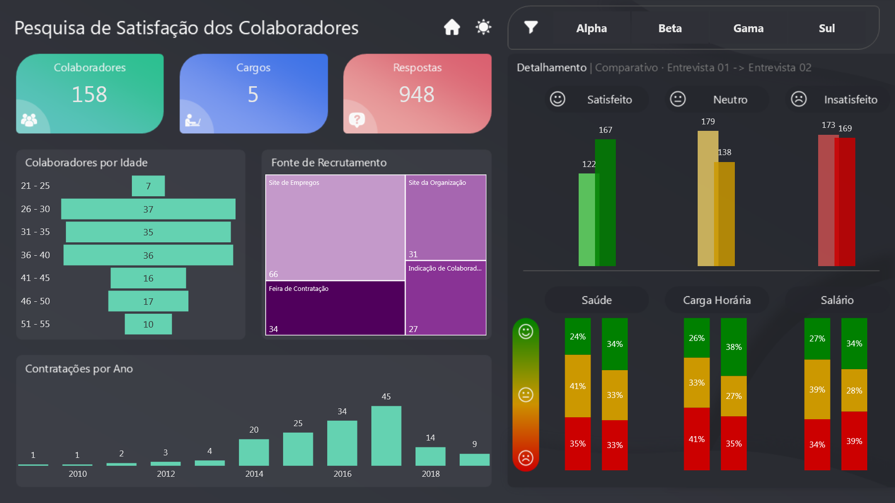

# 📊 Pesquisa de Satisfação dos Colaboradores — Nexora Group

## 📌 Visão Geral

Este projeto apresenta um **dashboard de pesquisa de satisfação dos colaboradores**, desenvolvido em **Power BI**, para a empresa fictícia **Nexora Group**.

A solução permite acompanhar indicadores estratégicos de clima organizacional, engajamento e retenção, comparando diferentes ciclos de entrevistas e facilitando decisões de gestão de pessoas.

🔎 [Dashboard Interativo](https://app.powerbi.com/view?r=eyJrIjoiNzZhNzE2YWEtZWNhMy00OGEzLTg0OTUtMzcyYmM3MGI2NGU2IiwidCI6IjIzY2FjN2VlLWYxZDgtNDMzOS1hYTdiLTc4MWFhOWY5MjI1YiJ9)

---

## 🧠 Contexto do Problema

A **Nexora Group** precisava compreender:

- O nível de satisfação dos colaboradores  
- Fatores que impactavam engajamento, retenção e clima organizacional  

A ausência de visão consolidada dificultava a comparação entre ciclos de entrevistas e a identificação de tendências comportamentais.

---

## 🎯 Abordagem Estratégica

O dashboard foi desenvolvido utilizando **Power BI** com **modelagem dimensional estruturada**, permitindo:

- Consolidação de indicadores como **Quantidade de Colaboradores, Cargos e Respostas Coletadas**  
- Análise comparativa entre **Entrevista 01** e **Entrevista 02**  
- Métricas de **Satisfeitos, Neutros e Insatisfeitos** em valores absolutos e percentuais  

O painel foi organizado para oferecer **leitura executiva clara** e **navegação intuitiva** entre as métricas.

---

## 📈 Impactos e Resultados

A solução permitiu:

- Identificar variações no nível de satisfação entre ciclos de avaliação  
- Mapear faixas etárias predominantes  
- Analisar fontes de recrutamento  
- Acompanhar histórico de contratações por ano  

Essas análises fortalecem decisões relacionadas a **retenção, desenvolvimento e gestão de clima organizacional**.

---

## 🧩 Estrutura do Dashboard

### Indicadores Principais

- **Colaboradores:** quantidade de colaboradores participantes  
- **Cargos:** quantidade de cargos monitorados  
- **Respostas:** consolidação das respostas coletadas  

### Visualizações Analíticas

- **Gráfico de barras horizontais:** distribuição de faixas etárias  
- **Treemap:** quantidade de recrutamento por canal  
- **Gráfico de barras verticais:** quantidade de contratações por ano  
- **Detalhamento da pesquisa:** comparação de Satisfeito, Neutro e Insatisfeito entre pesquisa 1 e pesquisa 2  
- **Gráfico de barras verticais empilhadas:** percentuais para Saúde, Carga Horária e Salário  

### Interatividade e Navegação

- **Filtro:** seleção da equipe entrevistada  
- **Link “Analisar Dashboard”** para abrir o dashboard interativo  
- **Modos Dark (padrão) e Light opcional**  
- **Ícone para voltar à Home** (descrição no README)

---

## 🛠️ Stack Técnica

- **Power BI**: construção do dashboard e storytelling analítico  
- **DAX**: criação de medidas percentuais comparativas  
- **Modelagem Dimensional**: organização de dados de colaboradores, cargos, recrutamento e avaliações  

---

## 🧱 Modelagem de Dados

**Tabelas Fato:**

- respostas da pesquisa  
- contratações  
- colaboradores  

**Tabelas Dimensão:**

- cargos  
- equipes  
- canais de recrutamento  
- faixas etárias  

---

# 📸 Preview do Dashboard

## Documentação das Medidas

Para consultar a documentação das medidas deste projeto, suas fórmulas e descrições, acesse a [Documentação das Medidas](docs/medidas-documentacao.md).

# 👨‍💻 Autor

Projeto desenvolvido como parte do meu portfólio profissional em **Business Intelligence e Data Analytics**, destacando habilidades avançadas e aplicáveis a diversos cenários analíticos:

- Desenvolvimento de **dashboards executivos e painéis estratégicos**, focados em insights acionáveis e tomada de decisão baseada em dados  
- **Modelagem dimensional e relacional**, aplicando corretamente **cardinalidade, granularidade** e hierarquias entre tabelas para garantir consistência e integridade dos dados  
- **Transformação de dados com Power Query e Linguagem M**, criando pipelines eficientes, automatizados e auditáveis  
- Criação de **KPIs estratégicos e métricas customizadas em DAX**, para análise de performance e comparações confiáveis  
- **Integração de múltiplas fontes de dados** (Excel, SQL, APIs, arquivos planos), padronizando e validando informações críticas  
- **Data storytelling e visualizações interativas**, com cores, hierarquias, filtros e destaque de insights, para facilitar interpretação e engajamento do usuário  
- **Análises estatísticas e preditivas**, usando Python, R, regressões, teste de hipóteses, séries temporais e técnicas de Machine Learning para identificação de tendências e padrões  
- **Automatização e otimização de processos analíticos**, incluindo ETL, scripts e compressão de dados, garantindo performance e escalabilidade dos relatórios  
- **Documentação detalhada de medidas, tabelas, modelos e processos**, permitindo reprodutibilidade, transparência e governança dos dados  
- Aplicação de **boas práticas de engenharia de dados**, integrando análise, estatística, IA e visualização para soluções analíticas completas e confiáveis  
- Domínio completo de **Power BI, DAX, Power Query, Python e R**, com foco em performance, qualidade e entrega de insights estratégicos

---

  
**Portfólio de Business Intelligence & Data Analytics**  

| [LinkedIn](https://www.linkedin.com/in/rogério-clynton-ribeiro/) | [Portfólio](https://clyntonboss.github.io/) |

